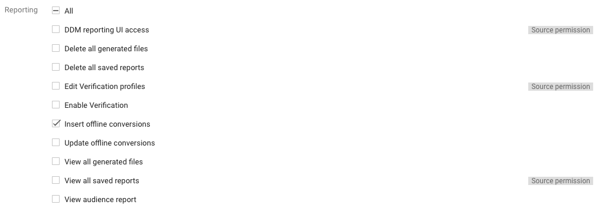
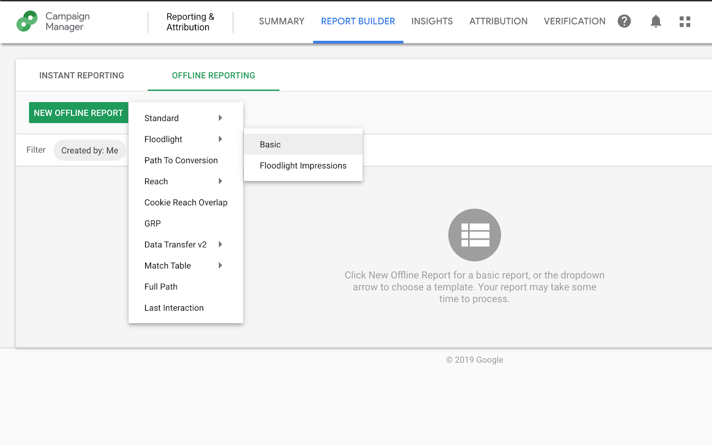

# Campaign Manager upload offline conversions

Not all conversions happen online, for some advertisers conversions may start
online and finish offline.  An example of this is a user that begins researching
a product online, clicks on an ad, and then completes the purchase in a store.
In this scenario, Campaign Manager will have data about the online portion of
the transaction, but not the offline portion, resulting in the conversion going
unrecorded.

In order to import offline conversion data back into the Campaign Manager (CM),
you can use the DCM/DFA Reporting and Trafficking API's
[Conversions][cm_conversions] service, and have the ability to join your online
conversions with offline activities.

You still need to build something on top of this to manage uploading conversions
when working on a large scale. If you can imagine, you will potentially be sending
100K of conversions back into CM - how do you manage this effectively with the API?

This is where Tentacles comes into place, which solves exactly this problem.

Please have a look here as to [how to deploy Tentacles][deploy_tentacles].

Once this is completed please follow the steps below which covers how to upload
conversions to Campaign Manager via the DCM/DFA Reporting and Trafficking API.

[cm_conversions]:https://developers.google.com/doubleclick-advertisers/current/conversions
[deploy_tentacles]:TBD

## Setting up Campaign Manager

Before you can use Tentacles to upload conversions into CM, please ensure the
following set up has been completed in your CM network:

### User Role and User Profile

If one doesn't already exists, create a [User role][user_role] that has the *Insert offline conversions*
permission:



Create a [User Profile][user_profile] for the service account's email with the
role that has the *Insert offline conversions* permission.

[user_role]:https://support.google.com/dcm/answer/6098287?hl=en#roles
[user_profile]:https://support.google.com/dcm/answer/6098287?hl=en#access

If you not sure about the service account, you can run following script:

```shell script
cd ~/cloud-for-marketing/marketing-analytics/activation/gmp-googleads-connector;
bash deploy.sh print_service_account
```

### Floodlight Activity

It is best to create a new floodlight activity, rather than reuse an existing
one for uploading offline conversions.  If you are tracking multiple types of
offline conversions, you should create a separate floodlight activity for each
type of conversion you want to track.  There is no need to actually deploy
floodlight activities used to track offline conversions onto your website.

Whether you should create a counter or sales floodlight activity depends on the
type of event you want to track.

* *Counter* activities record non-monetary data, for example, you are only
uploading the number of times a user has made a purchase in-store.
* *Sales* activities record monetary data, for example, you want to upload the
value of the transaction the user has made in-store.

For more details on creating floodlight activities in Campaign Manager, see
[this][floodlight].

[floodlight]:https://support.google.com/dcm/answer/6100588?hl=en&ref_topic=6095060

## Updating API configuration

To update the configuration for Tentacles to work with your respective Campaign
Manager advertiser, please follow the steps below:

* Start a Cloud Shell instance.

* Change to the Tentacles directory on your Cloud Shell:
```shell script
cd cloud-for-marketing/marketing-analytics/activation/gmp-googleads-connector
```

* Create a new file named `config_api.json` with a text editor, in this example
we will be using `vim`:
```
vim config_api.json
```
```json
{
  "CM": {
    "[YOUR_CONFIG_NAME]": {
      "cmAccountId": "[YOUR-DCM-ACCOUNT-ID]",
      "cmConfig": {
        "idType": "gclid",
        "conversion": {
          "floodlightConfigurationId": "[YOUR-FL-CONFIG-ID]",
          "floodlightActivityId": "[YOUR-FL-ACTIVITY-ID]",
        },
        "customVariables": [
          "[YOUR-U-VARIABLES-NAME-1]", "[YOUR-U-VARIABLES-NAME-2]"
        ]
      }
    }
  }
}
```

* In this example we will be uploading new conversions with customer variables
using `gclid` as the identifier (for more info click [here][conversions]). This
is where parameters common across all conversions should be stored:
  * `cmAccountId` - Network ID of your Campaign Manager account into which the
conversions should be uploaded.
  * `idType` - value can be: `encryptedUserId`, `gclid`, `mobileDeviceId` or
`matchId`.
    * `encryptedUserId`: a single encrypted user ID obtained from the %m match
  macro or Data Transfer.  Please note user IDs are no longer populated for EEA
  users and are expected to be globally redacted by September 30 2020.  For more
  details on the redaction please see [here][userId].
    * `gclid`: a Google Click Identifier generated by Google Ads or Search Ads
    360.
    * `mobileDeviceId`: an unencrypted mobile ID in the IDFA or AdID format.
    * `matchId`: a unique advertiser created identifier passed to Campaign
   Manager 360 via a Floodlight tag.
  * `floodlightConfigurationId` - Your Campaign Manager floodlight configuration
ID in which the floodlight activities you want to upload to reside.
  * `floodlightActivityId` - ID of the floodlight activity you want to use to
track the conversions.
  * `customVariables` - names of the customer floodlight variables you are
uploading. This is optional and can be omitted if not required.

[conversions]:https://developers.google.com/doubleclick-advertisers/v3.3/conversions#resource
[userId]:https://support.google.com/dcm/answer/9006418?hl=en&ref_topic=2823501

* After you have updated and saved your config file run the following script to
synchronize the configuration to Google Cloud Firestore/Datastore. Tentacles
 will pick up the latest configuration automatically.
```
./deploy.sh update_api_config
```

## Preparing data files

### File content type

The file needs to be in JSONL for the API call. Since we have already configured
the structure of the conversion in the config_api.json file, all we need to pass
in is the Google Click Identifier and details regarding the conversion itself.

In this example we are also uploading additional information regarding the
conversion itself, so you will have to create a
[custom floodlight variable][custom_variable] in CM so you can pass in the additional
information. Below is an example:

[custom_variable]:https://support.google.com/dcm/answer/2823222?hl=en

```json
{"gclid":"EAIaIQobChMI-v2WxM7g4wIVg4BwCh2KKwWdEAAYASAAEgLFAKE_BwE","ordinal":"334376","U2":"a","actionedDate":"2019-10-03 17:18:57","timestampMicros":"1570123137000000"}
{"gclid":"EAIaIQobChMI-v2WxM7g4wIVg4BwCh2KKwWdEAAYASAAEgLFAKE_BwE","ordinal":"334434","U2":"b","actionedDate":"2019-10-03 17:03:15","timestampMicros":"1570122195000000"}
{"gclid":"EAIaIQobChMI1Jyfyvz-5AIVlRmPCh0NlgqjEAAYASAAEgIFAKE_BwE","ordinal":"334248","U2":"a|b","actionedDate":"2019-10-03 15:23:15","timestampMicros":"1570116195000000"}

```

* `gclid` is referring to the click identifier generated by Google Ads or Search
Ads 360.
* `ordinal` is referring to how duplicate conversions should be handled.
  * If conversions have the same ordinal number, then these conversions are
  duplicated and only one survives.
  * If conversions have different ordinal number then they are treated as
  distinct conversions will all be processed.
  * If `ordinal` is absent, its default value is the run-time Unix epoch timestamp.
* `U2` is referring to custom floodlight variable with the index 2

### File naming convention

The name of this file should contain `API[CM]` and
`config[YOUR_CONFIGURATION_NAME]`. After it is exported to the Cloud Storage
bucket, it will trigger the `tentacles_init` function to start the process.

## Validating results

To verify that the conversions have been added correctly, you can run a standard
[floodlight report][floodlight_report] in Campaign Manager.
Note: Campaign Manager process these offline conversions in a daily offline
process, so it may take up to 24 hours for conversions to appear in your report.



[floodlight_report]:https://support.google.com/dcm/answer/2823790?hl=en
